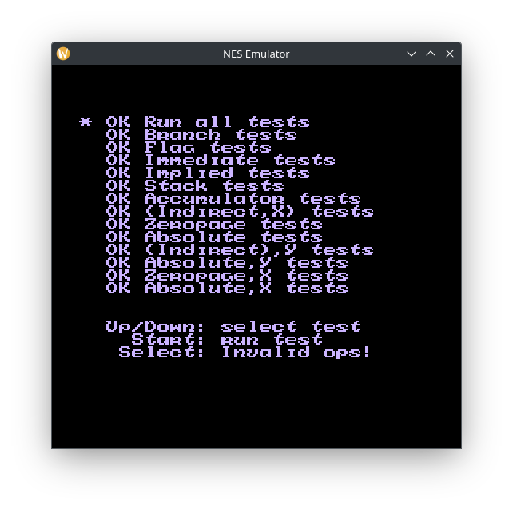

# NES Emulator
Work in progress.



## Build instructions
### Linux
* Install dependencies

Debian based distributions
```bash
sudo apt install build-essential cmake ninja-build libsdl2-dev libdbus-1-dev
```
Fedora
```bash
sudo dnf install gcc-c++ cmake ninja-build SDL2-devel dbus-devel
```
Arch Linux
```bash
sudo pacman -S gcc cmake ninja sdl2 dbus
```

* Build

Open the terminal application in the project directory and run the following commands
```bash
mkdir build
cd build
cmake -G Ninja ..
ninja
```

### Windows
* Install dependencies

Download [SDL2-devel-2.28.5-VC.zip](https://github.com/libsdl-org/SDL/releases/download/release-2.28.5/SDL2-devel-2.28.5-VC.zip) and extract it to **thirdparty** folder.

* Visual Studio

Open project folder in **Visual Studio**

* Command line

```bat
call "%VS_PATH%\VC\Auxiliary\Build\vcvars64.bat"
set SDL2_DIR="%cd%\thirdparty\SDL2-2.28.5\"
mkdir build
cd build
cmake -G "NMake Makefiles" -DCMAKE_BUILD_TYPE=Debug ..
nmake
```
