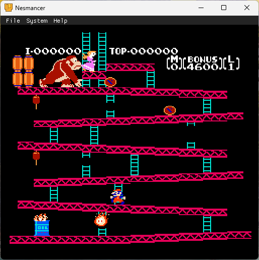

# Nesmancer


Nesmancer is a Nintendo Entertainment System emulator written in C++ for Windows and Linux.

The emulator is not cycle accurate.



## Features
* CPU: Official and unofficial opcodes
* PPU: NTSC
* APU: Implemented using Blargg's Audio Libraries - NesSndEmu
* Mappers: NROM(0), MMC1(1), UxROM(2), CNROM(3), MMC3(4)
* Gamepad: Support for both Player 1 and Player 2
* Xbox controller support
* ROM Files: iNes and Nes2 file formats
* System pause and resume

## Build instructions

### Windows

#### Install dependencies
* Install Visual Studio Community with C++ desktop development and **CMake**
* Download latest SDL Visual Studio binary from [SDL Github Releases](https://github.com/libsdl-org/SDL/) and extract it to **thirdparty** folder or any other directory and set the **SDL2_DIR** environment variable

#### Build
* Clone the repository and open **nesmancer** folder in **Visual Studio** or **Visual Studio Code**
* Build solution and run

### Linux

#### Install dependencies
* Debian/Ubuntu:
```
sudo apt install build-essential cmake ninja-build libsdl2-dev libdbus-1-dev
```

* Fedora:
```
sudo dnf install gcc-c++ cmake ninja-build SDL2-devel dbus-devel
```

* Arch:
```
sudo pacman -S gcc cmake ninja sdl2 dbus
```

#### Build
* Clone the repository and open the terminal application in the project directory and run the build commands:
```
mkdir build && cd build && cmake -G Ninja .. && ninja
```
* Run the emulator:
```
./nesmancer [path to ROM file]
```

## Usage
To open a ROM file use the **File->Open (Ctr+O)** menu or pass the ROM file as the first argument when launching the program.

## Controller configuration
Controller and keyboard mapping:

 Button     | Keyboard 1      | Keyboard 2      | XBox Controller  |
 -----------|-----------------|-----------------|------------------|
 A          | H key           | Numpad 2        | X                |
 B          | J key           | Numpad 3        | B                |
 Start      | U key           | Numpad 6        | Menu             |
 Select     | Y key           | Numpad 5        | Y                |
 Up         | W key           | Up key          | D-Pad/Left stick |
 Down       | S key           | Down key        | D-Pad/Left stick |
 Left       | A key           | Left key        | D-Pad/Left stick |
 Right      | D key           | Right key       | D-Pad/Left stick |
